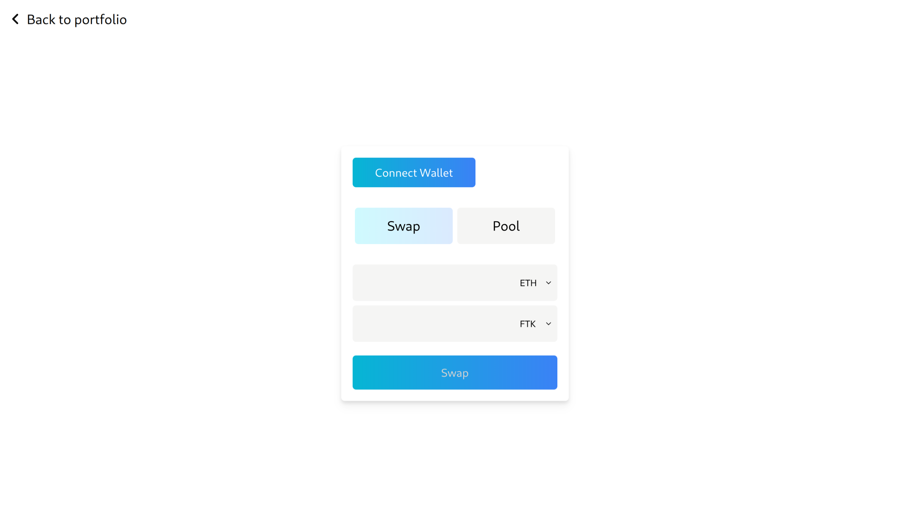

<br />
<div align="center">
  <h3 align="center">Fswap</h3>

  <p align="center">
    Experimental decentralized cryptocurrency exchange
    <br />
    <a href="https://fswap.floriangaspard.com">View online</a>
  </p>
</div>



# About

Front-end for [Fswap contracts](https://github.com/floriangaspard/fswap-contracts)
Contracts are deployed on Sepolia testnet only.

Built with React + TypeScript and TailwindCSS.

# Installation

```
npm install
```

# Getting started

## Start development server

```
  npm run start
```

## Build and run

1. Build

```
  npm run build
```

# Contact

floriangaspard.fg@gmail.com
